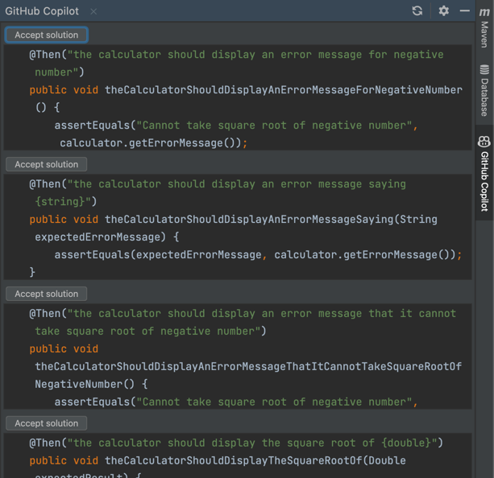

# Opdracht 1
##  Opdracht 1.1
Om Behaviour Driven Development uit te voeren moeten we eerst een test bestand genereren.
Dit kan in een framework zoals Cucumber of Gerhkin. 
In deze frameworks kan je rechtstreeks handelingen uitschrijven in leesbare zinnen die omschrijven wat de gebruiker doet.
Een voorbeeld van een Cucumber file ziet er uit alsvoort:
```
Scenario: Addition
    Given I have entered 2 into the calculator
    When I press add
    When I have entered 3 into the calculator
    Then the result should be 5 on the screen
```
Hierin wordt beschreven hoe het gedrag van een gebruiker is als deze een som wil maken in een rekenmachine met de verwachte uitkomst.

ChatGPT is een chatbot ontwikkelt door OpenAI op basis van het model GPT-3.5. Dit is momenteel een van de grootste/krachtigste AI language modellen die er bestaan op het moment. Een language model is een algoritme dat in feite alles wat betreft taal kan begrijpen.
Start je met een nieuw project? Dan heeft ChatGPT geen context nodig. Heb je al een project maar wil je dit uitbereiden met nieuwe testcases? Dan heb je wel wat context nodig. Dit komt verder op in de workshop naar boven.

Het doel voor de eerste opdracht is om 10 testcases te laten genereren door ChatGPT voor het maken van een rekenmachine. 

## Opdracht 1.2
Nu je een Cucumber file hebt, kan je een bestand aan maken in je IDE onder de folder:
```
- src
  - test
    - java
    - resources
      - features
        - my_feature.feature
```
Vervolgens kan je in je `src/test/java/com/example/calculator` een bestand aanmaken waarin de verschillende stappen van het cucumber bestand beschreven worden met de juist java code er bij.

Dan gaan we nu aan de slag met Github Copilot. Github Copilot is ook een language model net als ChatGPT, echter is Copilot meer gebaseert op code completion dan voor teksten schrijven.
Het mooie aan Copilot is dat je het op verschillende manieren kan gebruiken. Je kan een stuk code schrijven die afgemaakt wordt door Copilot, maar je kan ook in een regel comentaar neerzetten wat voor functionaliteit wilt hebben en dan kan Copilot dit ook genereren.
Copilot kan ook context van een project meenemen in het genereren van de code. Zo worden de juist codeconventions meegenomen.

Om de juiste stepfile te genereren maak een commentaar regel aan binnen de class die je net hebt aangemaakt.
`// Create the methods for the my_feature.feature file`. Vervolgens kan je door op `Tab` te drukken de code accepteren.

Het is ook mogelijk dat de code niet correct is, dan kan je via de Github Copilot extension andere versies van de code vinden.


## Opdracht 1.3
Zodra je de test code hebt geschreven kan je een nieuw bestand aanmaken voor de Calculator code.
Dit kan je ook doen aan de hand van Github Copilot. Maak een bestand aan onder het pad `src/main/java/com/examples/calculator` genaamd `Calculator.java`.
Geef aan in het commentaar `// Create the calculator methods used in the test`. Dit moet er voor zorgen dat de code gegenereerd word.


