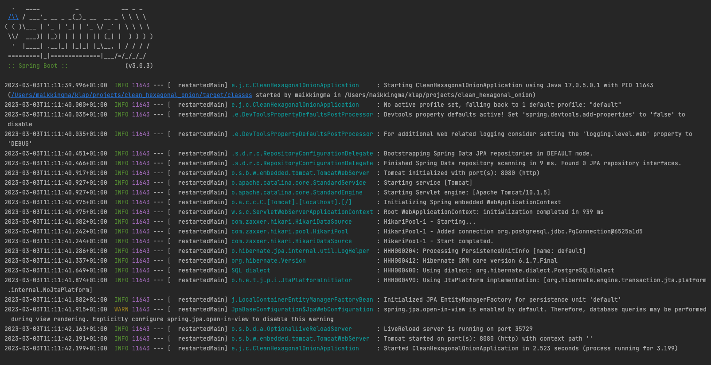

# Check out the Spring service

Setting up the project from scratch would take up too much time and focus away from the important content of this 
workshop. Hence, I took the liberty of preparing a repository that you can fork or clone.

Button to GitHub is located in the header menu. Alternatively, click 
[here](https://github.com/MaikKingma/javaland-clean-hexagonal-onion).

You can either check out the prepared setup branch or, optionally set the project up yourself.

```git checkout setup-done```

If you checked out this branch then you can proceed to the validation step and skip the following _**OPTIONAL**_ steps.
(there are still some mandatory steps after the optional ones). If you chose to set up the project yourself,
 please follow the **_OPTIONAL_** steps.

### OPTIONAL: DO IT YOURSELF

If you feel like you want to do it all yourself you can use Spring Initializr to setup our spring boot project.
- Go to the [Spring Initializr](https://bit.ly/javaland-spring-init)
- Choose your Project Dependency Manager of your choice (Maven or Gradle).
- Choose your Language of choice.
- For the Spring Boot version at least 2.7.0.
- Fill in the Project Metadata as you see fit, but make sure packaging is Jar and the Java version is 17.
- On the right-hand side you can see the add dependencies button. You need to add the following:
  - Spring Web
  - Spring Data JPA
  - PostgreSQL Driver
  - Liquibase Migration
  - Lombok
  - Spring Boot DevTools (optional)

### OPTIONAL: Your config should be something like this:


### OPTIONAL: Create the clean hexagonal onion folder structure


### OPTIONAL: Database
add these lines to ``src/main/resources/application.properties``

```properties
# DataSource
spring.datasource.url=jdbc:postgresql://localhost:5432/clean-hexagonal-onion-service
spring.datasource.username=postgres
spring.datasource.password=postgres
```

and create a ``./docker-compose.yml`` file and paste this content into it:
```yaml
version: '3.9'

services:
  postgres:
    image: postgres
    restart: always
    environment:
      POSTGRES_USER: postgres
      POSTGRES_PASSWORD: postgres
      POSTGRES_DB: clean-hexagonal-onion-service
    ports:
      - '5432:5432'
    healthcheck:
      test: ["CMD-SHELL", "pg_isready -d $${POSTGRES_DB} -U $${POSTGRES_USER}"]
      interval: 10s
      timeout: 5s
      retries: 5
```

## Validate
Run the docker-compose script from the IDE or from the terminal with ``docker compose up --build``.
Last but not least, in order to avoid errors for now, please comment out the liquibase dependency in your ``./pom.xml``.

> You may have to enable annotation processing in your IDE for the Lombok dependency.

Validate that the Spring application starts by running the application (without any errors).
similar to this:


All green? Well done! We are now ready to move on to the next chapter.

