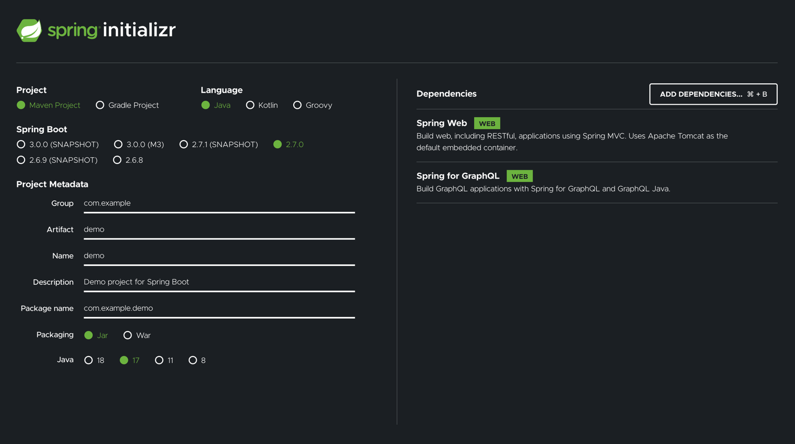

# Setup Spring Boot

We will use Spring Initializr to setup our spring boot project.
- Go to the [Spring Initializr](https://start.spring.io/)
- Chose your Project Dependency Manager of your choice (Maven or Gradle).
- Chose your Language of choice.
- For the Spring Boot version at least 2.7.0 (Spring for GraphQL has just reached 1.0 and is only compatible with versions ^2.7.0).
- Fill in the Project Metadata as you see fit, but make sure packaging is Jar and the Java version is ^11.
- On the right-hand side you can see the add dependencies button. You need the following two:
  - Spring Web
  - Spring for GraphQL

### Your config should be something like this:



## Validate
Import your project into your editor and validate that is start by running the application (without any errors)

## Enable GraphiQL
GraphiQL is an integrated tool that helps us query our API. See it as an integrated Postman. 
If we want to use it, we need to explicitly enable it. Go to you application.properties file and 
add this line: `spring.graphql.graphiql.enabled=true`. 
You'll also need a GraphQL schema file, In you're `src/main/resources` create a directory and file called `graphql/schema.graphqls`
with the following content:
```graphql
type Query {
    helloWorld: String!
}
```
If you did this properly, you can restart your service and go to [GraphiQL](http://localhost:8080/graphiql)
