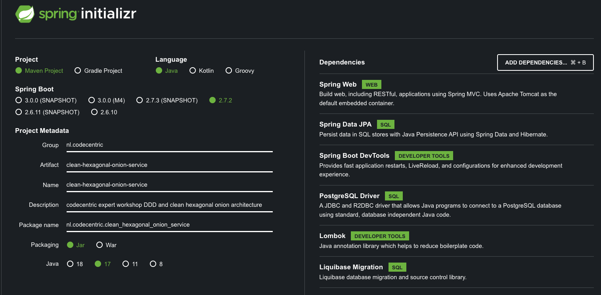
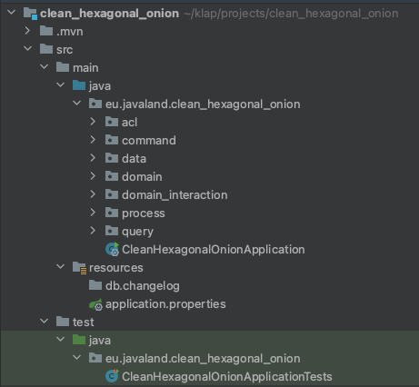

# Check out the Spring service

Setting up the project from scratch would take away too much time and focus from the important content of this workshop 
so I took the liberty of preparing a repository that you can fork.

https://github.com/MaikKingma/clean-hexagonal-onion-service

``Branch: setup-done``

If you checked out this branch then you can proceed to the validation step and skip the optional steps.


### OPTIONAL: DO IT YOURSELF

If you feel like you want to do it all yourself you can use Spring Initializr to setup our spring boot project.
- Go to the [Spring Initializr](https://start.spring.io/)
- Choose your Project Dependency Manager of your choice (Maven or Gradle).
- Choose your Language of choice.
- For the Spring Boot version at least 2.7.0.
- Fill in the Project Metadata as you see fit, but make sure packaging is Jar and the Java version is 17.
- On the right-hand side you can see the add dependencies button. You need to add the following:
  - Spring Web
  - Spring Data JPA
  - Spring Boot Starter Test
  - PostgreSQL Driver
  - Liquibase Migration
  - Lombok
  - Spring Boot DevTools (optional)

### OPTIONAL: Your config should be something like this:


### OPTIONAL: Create the clean hexagonal onion folder structure


### OPTIONAL: Database
add these lines to ``src/main/resources/application.properties``

```properties
# DataSource
spring.datasource.url=jdbc:postgresql://localhost:5432/clean-hexagonal-onion-service
spring.datasource.username=postgres
spring.datasource.password=postgres
```

and create a ``./docker-compose.yml`` file and paste this content into it:
```yaml
version: '3.1'

services:
  postgres:
    image: postgres
    restart: always
    environment:
      POSTGRES_USER: postgres
      POSTGRES_PASSWORD: postgres
      POSTGRES_DB: clean-hexagonal-onion-service
    ports:
      - "5432:5432"
    network_mode: "bridge"
```
Now run the docker-compose script from the IDE or from the terminal with ``docker-compose up``.
Last but not least to avoid errors for now please comment out the liquibase dependency in your ``./pom.xml``.

## Validate
Import your project into your IDE and validate that it starts by running the application (without any errors)


