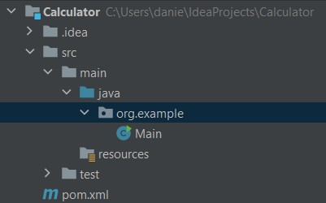

# Opdracht 1: Rekenmachine
Je zit op je opdracht in een nieuw project. Voor dit project moet een rekenmachine worden gebouwd. Dit moet je doen door gebruik te maken van Behaviour-driven development BDD. Vanuit de business heb je de volgende vier requirements gekregen:

Requirements:

- Optellen: de rekenmachine moet een methode bieden om twee of meer getallen bij elkaar op te tellen, met ondersteuning voor decimalen en negatieve waarden.

- Aftrekken: de rekenmachine moet een methode bevatten om het ene getal van het andere af te trekken, inclusief decimalen en negatieve waarden.

- Vermenigvuldiging: de rekenmachine moet een methode bieden om twee of meer getallen met elkaar te vermenigvuldigen, waarbij decimalen en negatieve waarden worden ondersteund.

- Delen: de rekenmachine moet een methode bevatten om het ene getal door het andere te delen, met ondersteuning voor decimalen en het omgaan met deling door nul-fouten.

##  1.1 Cucumber Feature file maken.

Een feature file beschrijft een scenario in begrijpelijke mensentaal. In die feature file wordt het gewenste gedrag beschreven welke stappen er genomen dienen te worden om tot een bepaald resultaat te komen.

Een voorbeeld van een feature file ziet er uit als volgt:
```
Scenario: Scenarionaam
    Given I have one pizza
    And Cut the pizza in 8 slices
    When I eat 2 slices
    Then The result is 6 slices left
```

Opdracht: Genereer een Cucumber feature file met de gegeven requirements in ChatGPT.

Opdracht: Maak een nieuwe directory in je project in Intellij aan genaamd: "features"

Als de feature file is gegenereerd, kan je de gegenereerde code kopiëren. Plak de code in een bestand in de features folder zoals hieronder weergegeven. Maak dit bestand eerst aan.
```
- src
  - test
    - java
    - resources
      - features
        - calculator.feature
```
## 1.2 Maak een step file aan
Een step file is een bestand dat de implementatie van de stappen beschrijft die in een scenario zijn gedefinieerd.

De step file koppelt de stappen uit de Gherkin scenario's aan de daadwerkelijke Java klasse voor de calculator in dit geval. De step file kan gezien worden als de koppeling tussen De uiteindelijke implementatie en de feature file met Gherkin. 

een step file in Java wordt geschreven als een Java-klasse met behulp van Cucumber's Java API. Deze klasse bevat methoden die zijn geannoteerd door specifieke Cucumber-annotaties, zoals @Given, @When, @Then, @And en @But.

Opdracht: Maak een bestand aan in de map zoals hieronder in de afbeelding weergegeven. Geef dit bestand de naam: `CalculatorSteps.java`.


Aangezien ChatGPT gesprekscontext begrijpt,  is het niet nodig om context mee te geven aan de vraag of ChatGPT de step file wilt genereren. De eerder gegeneerde Gherkin code wordt automatisch gebruikt om het vervolg te maken.

<b>
Vraag aan ChatGPT of deze de step file wilt genereren in java.
</b>

## 1.3 Calculator applicatie

Tot slot, om de cucumber testen te laten slagen is de java code nodig voor de calculator zelf. Dit kan je doen op de zelfde manier als bij opdracht 1.1 & 1.2.

Maak eerst een nieuw Java-bestand aan in je project voor de Calculator-klasse. Plaats het onder `src/main/java/com/example` met de bestandsnaam `Calculator.java`.



Opdracht: Plak de gegeneerde code door ChatGPT in het `Calculator.java` bestand.

## 1.4 run test
Om te kijken of de testen nu slagen kan je de Cucumber test file uitvoeren door rechter muisknop te drukken op de `calculator.feature` en op `run feature: calculator` te drukken.

Als alles in een keer goed gaat heb je nu geen faalden testen. Echter bestaat er een mogelijkheid dat er toch iets fout gaat. 
Als dit fout gaat kan je proberen om de foutmelding in ChatGPT te geven samen met de methode waar het fout gaat. Dan kan ChatGPT dit in sommige gevallen oplossen.

Zo niet? probeer er achter te komen wat er mis gaat en het zelf op te lossen. Kom je er echt niet uit vraag iemand met een the/experts. shirt om wat hulp.

## 1.5 Uitbreiden
Herhaal bovenstaande stappen en voeg extra functionaliteit toe aan de calculator voor de volgende 6 requirements.

-Exponentiation: The calculator should offer a method for raising a number to a given power, including fractional and negative exponents.

-Square root: The calculator should have a method for calculating the square root of a given number, handling both positive and negative input values.

-Factorial: The calculator should provide a method for calculating the factorial of a non-negative integer.

-Logarithms: The calculator should include methods for calculating natural logarithms (base e) and common logarithms (base 10) of positive numbers.

-Trigonometry: The calculator should offer methods for calculating sine, cosine, and tangent of angles, with support for both radians and degrees.

-Memory functions: The calculator should have methods for storing, recalling, and clearing a value in its memory, allowing users to perform more complex calculations with ease.
