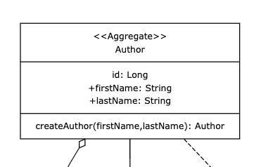
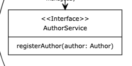

# Create the register Author command

For this step you will need to create classes and an interface in three (four if you include the domain 
interaction layer) parts of the "clean hexagonal onion".

### Command

We need to create a REST endpoint that allows us to register Authors.

```json
POST /authors/commands/register
Content-Type: application/json
Response: 202 - Accepted
Body:
{
    "firstName": "Maik",
    "lastName": "Kingma"
}
```
This endpoint should create an Author from the given DTO payload and call the register function of an author on the 
domain interaction layer service.

### Domain

According to the domain model we need to create the class ```/domain/author/Author.java``` in our domain. In order to 
keep control of the creation of our aggregates we make the all args constructor private and instead create a 
factory method```public static Author createAuthor(String fristName, String lastName)```.
For now that is all we need. No getters, no setters, or builders needed for now. In case you are asking yourself: 
_And what about the id?_ Rest assured! we will solve this later. It remains null for now.



####Domain interaction layer
In order to be able to manipulate or persist our core domain objects we need to define an interface
```/domain/author/AuthorService.java``` in our domain package according to the domain model. We now inject this into 
our ```AuthorCommands.java```class in the constructor (you could autowire it but let's stick to constructor injection).
Nice to know: this complies with the SOLID principle (dependency inversion).



### Data Source
No injection without at least one Spring Bean implementing the interface. In ```/datasource/author/AuthorServiceImpl.
java``` we implement ```/domain/author/AuthorService.java``` and annotate it with the ```@Service``` annotation from Spring. 
For now 
simply add a log 
statement to the 
method 
```void registerAuthor(Author author)```

### Validation
Let's test our code. Feel free to write your own test. Alternatively, copy paste this test class into your project 
and run it. All should be green :-)

```java
@SpringBootTest
@AutoConfigureMockMvc
class AuthorCommandsTest {

    @Autowired
    private MockMvc mockMvc;

    @Autowired
    private ObjectMapper objectMapper;

    @Test
    void register() throws Exception {
        //given
        var registerAuthorDTOJson = objectMapper.writeValueAsString(new RegisterAuthorDTO("firstName", "lastName"));

        //when //then
        mockMvc.perform(post("/authors/commands/register")
                        .contentType(MediaType.APPLICATION_JSON)
                        .content(registerAuthorDTOJson))
                .andExpect(status().isAccepted());
    }
}
```

DONE! Let's move on to the next topic: **Persisting Data**.


