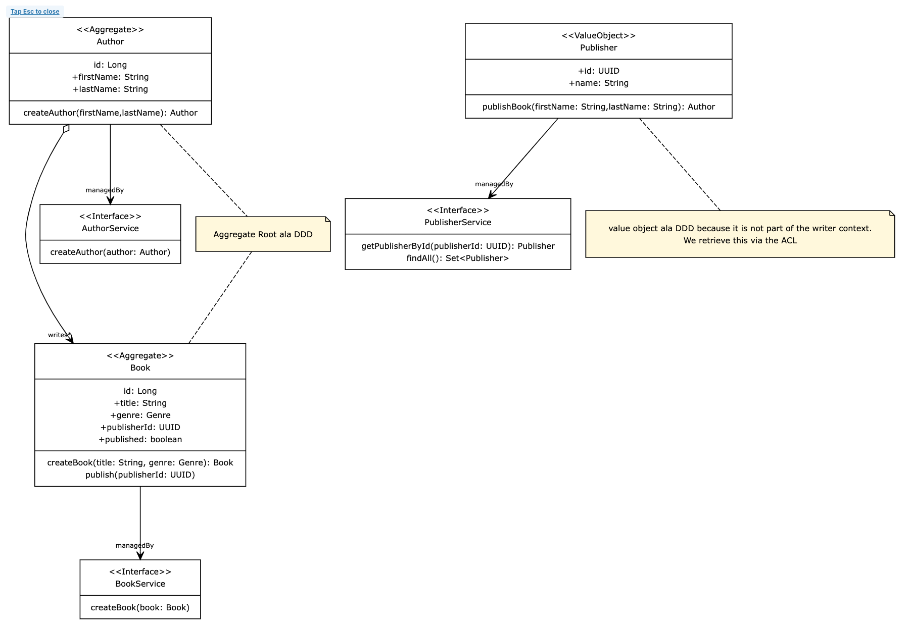

# N+1 - Do it yourself

Back to school ;P . You learn the theory, then you apply it to something new.
What would Authors be without books. Remember our domain model and API spec:

### Domain Diagram


### The API
```
### DONE
POST /authors/commands/register
GET /authors

### TODO in this assignment
POST /authors/{id}/commands/writeBook
GET /books?title

### TODO in ACL later on
POST /books/{id}/commands/publish
```

### The assignment
Your new assignment is to enable Authors to write a book. Try to find out which steps you need to take in order to 
do so. Try to backtrace the steps we have taken so far.

To not get hung up on Database evolution, here is the liquibase script you will need:

* Update ``src/main/resources/db/db.changelog-master.xml``
```xml
<?xml version="1.0" encoding="UTF-8"?>
<databaseChangeLog
        xmlns:xsi="http://www.w3.org/2001/XMLSchema-instance"
        xmlns="http://www.liquibase.org/xml/ns/dbchangelog"
        xsi:schemaLocation="http://www.liquibase.org/xml/ns/dbchangelog http://www.liquibase.org/xml/ns/dbchangelog/dbchangelog-latest.xsd">
    <include file="changelog/01_create_author_seq.xml" relativeToChangelogFile="true"/>
    <include file="changelog/02_create_author_table.xml" relativeToChangelogFile="true"/>
    <include file="changelog/03_create_book_seq.xml" relativeToChangelogFile="true"/>
    <include file="changelog/04_create_book_table.xml" relativeToChangelogFile="true"/>
</databaseChangeLog>
```

* Add file ``changelog/03_create_book_seq.xml``
```xml
<?xml version="1.0" encoding="UTF-8"?>
<databaseChangeLog
        xmlns="http://www.liquibase.org/xml/ns/dbchangelog"
        xmlns:xsi="http://www.w3.org/2001/XMLSchema-instance"
        xsi:schemaLocation="http://www.liquibase.org/xml/ns/dbchangelog http://www.liquibase.org/xml/ns/dbchangelog/dbchangelog-3.6.xsd">

    <changeSet id="03-create-book-sequence" author="Maik Kingma">
        <comment>Create Book sequence</comment>
        <createSequence sequenceName="book_seq" minValue="10001"/>
    </changeSet>
</databaseChangeLog>
```

* Add file ``changelog/04_create_book_table.xml``
```xml
<?xml version="1.0" encoding="UTF-8"?>
<databaseChangeLog
        xmlns="http://www.liquibase.org/xml/ns/dbchangelog"
        xmlns:xsi="http://www.w3.org/2001/XMLSchema-instance"
        xsi:schemaLocation="http://www.liquibase.org/xml/ns/dbchangelog http://www.liquibase.org/xml/ns/dbchangelog/dbchangelog-3.6.xsd">

  <changeSet id="04-create-book-table" author="Maik Kingma">
    <comment>Create book table</comment>
    <createTable tableName="book">
      <column name="id" type="bigint">
        <constraints primaryKey="true" primaryKeyName="book_id_pk" nullable="false"/>
      </column>
      <column name="title" type="text">
        <constraints nullable="false"/>
      </column>
      <column name="author_id" type="bigint">
        <constraints nullable="false"/>
      </column>
      <column name="genre" type="text">
        <constraints nullable="false"/>
      </column>
      <column name="published" type="boolean" defaultValue="false"/>
      <column name="publisher_id" type="uuid"/>
      <column name="isbn" type="text"/>
    </createTable>

    <addForeignKeyConstraint
            baseColumnNames="author_id"
            baseTableName="book"
            constraintName="FK_AUTHOR_BOOK"
            deferrable="false"
            initiallyDeferred="false"
            onDelete="RESTRICT"
            onUpdate="RESTRICT"
            referencedColumnNames="id"
            referencedTableName="author"
            validate="true"/>
  </changeSet>
</databaseChangeLog>
```

Let's assume we have 4 genres available: 'FANTASY','HORROR', 'CRIME', 'ROMANCE'. Make sure to add the enum in the 
code accordingly.

Now try to complete the rest!

...Some things to watch our for

* Remember that an entity in DDD is not the same as an entity in the DB sense. So the OneToMany and ManyToOne relation 
  annotations need to be placed on the JPA data model classes only.

```java
    @OneToMany(mappedBy = "authorJPA", fetch = FetchType.LAZY, cascade = CascadeType.ALL)
    private Set<BookJPA> books;
```
and
```java
    @ManyToOne(fetch = FetchType.LAZY)
    @JoinColumn(name = "author_id")
    private AuthorJPA author;
```

**GOOD LUCK!**

... 

### Validate

Done? Let's test your implementation:

* the test for the creation of books:
```java
@SpringBootTest
@AutoConfigureMockMvc
class AuthorActionCommandsTest {

    @Autowired
    private MockMvc mockMvc;

    @Autowired
    private ObjectMapper objectMapper;

    @Autowired
    private AuthorRepository authorRepository;

    @Autowired
    private BookRepository bookRepository;

    @Autowired
    private EntityManager entityManager;

    @BeforeEach
    void beforeAll() {
        authorRepository.deleteAll();
        bookRepository.deleteAll();
    }

    @Test
    @Transactional
    void writeBook() throws Exception {
        // given
        entityManager.createNativeQuery(
                "INSERT INTO author (id, first_name, last_name) VALUES (?,?,?)")
                .setParameter(1, 1)
                .setParameter(2, "firstName")
                .setParameter(3, "lastName")
                .executeUpdate();

        var writeBookDTOJson = objectMapper.writeValueAsString(new WriteBookDTO("title", Genre.CRIME));
        var expected = BookJPA.builder()
                               .title("title")
                               .genre(Genre.CRIME)
                               .published(false)
                               .author(AuthorJPA.builder().id(1L).build())
                .build();
        // when
        mockMvc.perform(post("/authors/1/commands/writeBook")
                        .contentType(MediaType.APPLICATION_JSON)
                        .content(writeBookDTOJson))
                .andExpect(status().isAccepted());
        bookRepository.flush();
        // then
        List<BookJPA> books = bookRepository.findAll();
        assertThat(books.size()).isEqualTo(1);
        assertThat(books.get(0)).usingRecursiveComparison().ignoringFields("id").isEqualTo(expected);
    }
}
```
* the test for querying of books:
```java
@SpringBootTest
@AutoConfigureMockMvc
class BookQueriesTest {

    @Autowired
    private MockMvc mockMvc;

    @Autowired
    private ObjectMapper objectMapper;

    @Autowired
    private BookRepository bookRepository;

    @Autowired
    private EntityManager entityManager;

    @Test
    @Transactional
    void shouldFindBooksWithNoQueryParam() throws Exception {
        // given
        entityManager.createNativeQuery(
                        "INSERT INTO author (id, first_name, last_name) VALUES (?,?,?)")
                .setParameter(1, 1)
                .setParameter(2, "firstName")
                .setParameter(3, "lastName")
                .executeUpdate();
        var book1 = BookJPA.builder()
                .author(AuthorJPA.builder().id(1L).build())
                .genre(Genre.HORROR)
                .title("horror-book")
                .build();
        var book2 = BookJPA.builder()
                .author(AuthorJPA.builder().id(1L).build())
                .genre(Genre.ROMANCE)
                .title("romance-book")
                .build();
        var expectedBookView1 = new BookView("horror-book", "firstName lastName", null);
        var expectedBookView2 = new BookView("romance-book", "firstName lastName", null);

        bookRepository.saveAll(List.of(book1, book2));
        bookRepository.flush();
        // when
        MvcResult result = mockMvc.perform(get("/books")
                        .accept(MediaType.APPLICATION_JSON))
                .andExpect(status().isOk())
                .andReturn();
        // then
        var resultingBookViews = objectMapper.readValue(
                result.getResponse().getContentAsString(), new TypeReference<List<BookView>>() {});
        assertThat(resultingBookViews).hasSize(2);
        assertThat(resultingBookViews).usingRecursiveFieldByFieldElementComparatorIgnoringFields("id")
                .containsExactlyInAnyOrder(expectedBookView1, expectedBookView2);
    }

    @Test
    @Transactional
    void shouldFindBooksFilteredByQueryParamTitle() throws Exception {
        // given
        entityManager.createNativeQuery(
                        "INSERT INTO author (id, first_name, last_name) VALUES (?,?,?)")
                .setParameter(1, 1)
                .setParameter(2, "firstName")
                .setParameter(3, "lastName")
                .executeUpdate();
        var book1 = BookJPA.builder()
                .author(AuthorJPA.builder().id(1L).build())
                .genre(Genre.HORROR)
                .title("horror-book")
                .build();
        var book2 = BookJPA.builder()
                .author(AuthorJPA.builder().id(1L).build())
                .genre(Genre.ROMANCE)
                .title("romance-book")
                .build();
        var expectedBookView = new BookView("horror-book", "firstName lastName", null);

        bookRepository.saveAll(List.of(book1, book2));
        bookRepository.flush();
        // when
        MvcResult result = mockMvc.perform(get("/books")
                    .accept(MediaType.APPLICATION_JSON)
                    .queryParam("title", "orror-"))
                .andExpect(status().isOk())
                .andReturn();
        // then
        var resultingBookViews = objectMapper.readValue(
                result.getResponse().getContentAsString(), new TypeReference<List<BookView>>() {});
        assertThat(resultingBookViews).hasSize(1);
        assertThat(resultingBookViews).usingRecursiveFieldByFieldElementComparatorIgnoringFields("id")
                .containsExactly(expectedBookView);
    }
}
```

Hope all worked out for you! Once again:

```javascript
if (allTestsGreen == true) {
    log.info("DONE! Let's move on to the next topic: The ACL adapter")}
else{
    log.error("Shout for help!") || (git stash && git checkout 7-n+1-done)
}
```
