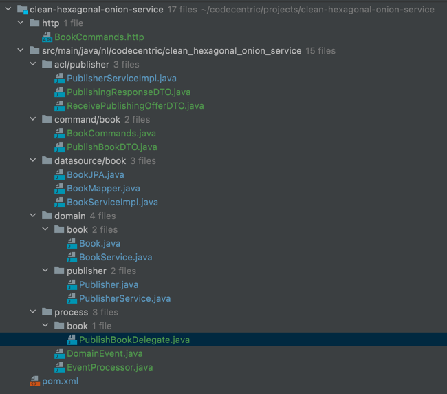

# The Process Adapter

We still want to publish a book. We know all available publishers from the previous section and made it available in 
our bounded context.

Assuming we have already created a manuscript as an author, we can now decide to publish that manuscript with one of 
the available publishers.

### The command
For that purpose we create the ``/commands/book/BookCommands.java`` class containing our new command API endpoint:

```http request
POST /books/{id}/commands/publish HTTP/1.1
Host: localhost:8080
Content-Type: application/json

{
  "publisherId": "6b4ca9c9-b3ae-4130-b3f8-2da873c3940e"
}
```
The behaviour of this endpoint should comply with the following functional requirements:
* A book can only be published with a publisher that actually exits. SO, we need to validate that the chosen 
  publisher exists in the source context of publishers, the publisher service.
* We want the publishing to happen asynchronous, i.e. our command should simply return that it accepted the 
  publishing request, and it will be passed on for further processing. (Eventual Consistency).

We achieve this passing for further processing by publishing a domain event (reference https://www.baeldung.com/spring-data-ddd#use-abstractaggregateroot-template)

While it looks easy at first sight, we need to invest a little more coding effort than Baeldung because we 
segregated the data entity from the actual domain aggregate.

### 1. Task: Implement another ACL adapter.
First things first: in order to validate the existence of a publisher by Id the publisher service from the previous
section exposes this endpoint:

```http request
### Get authors
GET /publishers/{id} HTTP/1.1
Host: localhost:8081
Accept: application/json
```
implement this in our ACL adapter
### 2. Task: Implement Book Command
implement our new book commands endpoint and for now only log the response of the getPublisherById call
```http request
POST /books/{id}/commands/publish HTTP/1.1
Host: localhost:8080
Content-Type: application/json

{
  "publisherId": "6b4ca9c9-b3ae-4130-b3f8-2da873c3940e"
}
```
### 3. Task: Get the Book by ID
Retrieve the book corresponding to the ID form the path parameter
### 4. Task: Allow book publishing
No publishing without a publisher. Hence, publishing should only be triggerable from within a publisher class. Add 
this function to ``Publisher.java``
```java
public void publishBook(Book book) {
    book.requestPublishing(id);
}
```
### 5. Task: Update the domain and data source
We want to allow a publishing request and the publishing of domain events.
To be bale to handle domain events we need a new dependency in our ``pom.xml``:
```xml
<dependency>
    <groupId>org.springframework.data</groupId>
    <artifactId>spring-data-commons</artifactId>
    <version>2.7.2</version>
</dependency>
```

The challenge of this task is to actually register domain events on the domain, but then also map them to 
the actual JPA entity which will eventually be persisted by the Repo, which in turn will trigger the handling of domain events in 
``AbstractAggregateRoot.java``.

Here are some useful snippets. Can you place them in the correct places?
```java
    @Getter
    private final List<DomainEvent> domainEvents = new ArrayList<>();
```
Our Domain event
```java
    @Value
    public static class RequestPublishingEvent extends DomainEvent {
        Long bookId;
        UUID publisherId;
    }
    // and
    public abstract class DomainEvent {}
```

The following snippet provides us the support of handling the Domain events correctly.
```java
public class BookJPA extends AbstractAggregateRoot<BookJPA> {
    // ...
    public void registerDomainEvents(List<DomainEvent> domainEvents) {
      domainEvents.forEach(this::andEvent);
    }
}
```
In the class ``Book.java`` we need to implement the method requestPublishing(id: UUID) which we previously referenced in 
task 4.
```java
    public void requestPublishing(UUID publisherId) {
        // TODO assign the publisherID
        // TODO and register a domain event
    }
```
Having done all that the ``AbstractAggregateRoot`` will do the publishing for us. So on to the next task: we need to 
be able to consume these events:

### 6. Task: Consume the published domain event.

Create a class ``/process/EventProcessor.java``:
```java
import lombok.extern.slf4j.Slf4j;
import nl.codecentric.clean_hexagonal_onion_service.domain.book.Book;
import nl.codecentric.clean_hexagonal_onion_service.process.book.PublishBookDelegate;
import org.springframework.scheduling.annotation.Async;
import org.springframework.stereotype.Component;
import org.springframework.transaction.event.TransactionalEventListener;

import static org.springframework.transaction.event.TransactionPhase.AFTER_COMMIT;

@Slf4j
@Component
public class EventProcessor {

    private final PublishBookDelegate publishBookDelegate;

    public EventProcessor(PublishBookDelegate publishBookDelegate) {
        this.publishBookDelegate = publishBookDelegate;
    }
    
    @TransactionalEventListener(phase = AFTER_COMMIT)
    public void handleEvent(Book.RequestPublishingEvent requestPublishingEvent) {
        log.info(requestPublishingEvent.toString());
        publishBookDelegate.publishBook(requestPublishingEvent);
    }
}
```

This implementation will allow for the domain events on a JPA entity to be processed after the transaction was 
committed.

### 7. Task: Delegate Implementation
Now try to actually implement the ``/process/book/PublishBookDelegate.java`` class.

Useful snippet:
````java
@Service
public class PublishBookDelegate {

  private final BookService bookService;
  private final PublisherService publisherService;


  public PublishBookDelegate(BookService bookService, PublisherService publisherService) {
    this.bookService = bookService;
    this.publisherService = publisherService;
  }

  @Transactional(propagation = REQUIRES_NEW)
  public void publishBook(Book.RequestPublishingEvent event) {
    // retrieve book by id from event
    
   // request the publishing of the book via the Publisher ACL layer (also see API docs below)

    // update the isbn of the book you received as a response and then store the book
  }
}
````

The API on the publisher service is defined as follows:
```http request
POST /publishers/receiveBookOffer
Host: localhost:8081
Content-Type: application/json

{
  "publisherId": "<SOME-UUID>",
  "author": "author name",
  "title": "Cool Title"
}

Returns:
{
  "isbn": "ISBN-3895b77d-ee27-40de-9b08-bf24fe2a013a"
}
```
This is our most complex change yet so here is an overview of files you need to somehow touch along the way:



### Validate

Let's test your implementation:

Testing the endpoint:
```java
import com.fasterxml.jackson.databind.ObjectMapper;
import org.junit.jupiter.api.Test;
import org.mockserver.client.MockServerClient;
import org.mockserver.model.Header;
import org.mockserver.springtest.MockServerTest;
import org.springframework.beans.factory.annotation.Autowired;
import org.springframework.boot.test.autoconfigure.web.servlet.AutoConfigureMockMvc;
import org.springframework.boot.test.context.SpringBootTest;
import org.springframework.http.MediaType;
import org.springframework.test.web.servlet.MockMvc;
import org.springframework.transaction.annotation.Transactional;

import javax.json.Json;
import javax.persistence.EntityManager;
import java.util.UUID;
import java.util.concurrent.TimeUnit;

import static org.mockserver.matchers.Times.exactly;
import static org.mockserver.model.HttpRequest.request;
import static org.mockserver.model.HttpResponse.response;
import static org.springframework.test.web.servlet.request.MockMvcRequestBuilders.post;
import static org.springframework.test.web.servlet.result.MockMvcResultMatchers.status;

@MockServerTest
@SpringBootTest
@AutoConfigureMockMvc
class BookCommandsTest {

    private static final Long BOOK_ID = 1L;
    private static final Long AUTHOR_ID = 2L;

    @Autowired
    private MockMvc mockMvc;

    @Autowired
    private ObjectMapper objectMapper;

    @Autowired
    private EntityManager entityManager;

    private MockServerClient mockServerClient;

    @Test
    @Transactional
    void publishBook() throws Exception {
        UUID publisherUUID = UUID.randomUUID();
        configureMockGetPublisherById(publisherUUID.toString());
        entityManager.createNativeQuery(
                        "INSERT INTO author (id, first_name, last_name) VALUES (?,?,?)")
                .setParameter(1, AUTHOR_ID)
                .setParameter(2, "firstName")
                .setParameter(3, "lastName")
                .executeUpdate();

        entityManager.createNativeQuery(
                        "INSERT INTO book (id, title, author_id, genre, published, publisher_id, isbn) " +
                                "VALUES (?,?,?,?,?,?,?)")
                .setParameter(1, BOOK_ID)
                .setParameter(2, "title")
                .setParameter(3, AUTHOR_ID)
                .setParameter(4, "HORROR")
                .setParameter(5, false)
                .setParameter(6, null)
                .setParameter(7, null)
                .executeUpdate();

        entityManager.flush();

        var requestPublishingDTO = objectMapper.writeValueAsString(new PublishBookDTO(publisherUUID));
        // when
        mockMvc.perform(post(String.format("/books/%d/commands/publish", BOOK_ID))
                        .contentType(MediaType.APPLICATION_JSON)
                        .content(requestPublishingDTO))
                .andExpect(status().isAccepted());
    }

    private void configureMockGetPublisherById(String publisherId) {
        var responseBody = Json.createObjectBuilder()
                        .add("id", publisherId)
                        .add("name", "Codecentric")
                        .add("taxNumber", "VAT12345")
                        .add("numberOfEmployees", 30)
                        .add("yearlyRevenueInMillions", 99)
                        .add("amountOfBooksPublished", 20)
                        .build().toString();

        mockServerClient.when(request().withMethod("GET").withPath("/publishers/" + publisherId), exactly(1)).respond(
                response()
                        .withStatusCode(200)
                        .withHeaders(new Header("Content-Type", "application/json; charset=utf-8"))
                        .withBody(responseBody)
                        .withDelay(TimeUnit.SECONDS,1)
        );
    }
}
```
Testing the event publishing (we need a helper class for this one):
``src/test/.../domain/book/TestEventHandler.java``
```java
import nl.codecentric.clean_hexagonal_onion_service.process.DomainEvent;
import org.springframework.transaction.event.TransactionalEventListener;

interface TestEventHandler {
    @TransactionalEventListener()
    void handleEvent(DomainEvent event);

}
```
 ``src/test/.../domain/book/BookTest.java``
```java
import nl.codecentric.clean_hexagonal_onion_service.datasource.author.AuthorRepository;
import nl.codecentric.clean_hexagonal_onion_service.domain.author.Author;
import nl.codecentric.clean_hexagonal_onion_service.domain.author.AuthorService;
import org.junit.jupiter.api.Test;
import org.springframework.beans.factory.annotation.Autowired;
import org.springframework.boot.test.context.SpringBootTest;
import org.springframework.boot.test.mock.mockito.MockBean;
import org.springframework.test.context.junit.jupiter.SpringJUnitConfig;

import java.util.UUID;

import static org.mockito.Mockito.times;
import static org.mockito.Mockito.verify;

@SpringJUnitConfig
@SpringBootTest
class BookTest {

  @MockBean
  private TestEventHandler eventHandler;

  @Autowired
  private BookService bookService;

  @Autowired
  private AuthorService authorService;

  @Autowired
  private AuthorRepository authorRepository;

  @Test
  void shouldPublishEventOnSavingAggregate() {
    var author = Author.builder().firstName("first").lastName("last").build();
    authorService.registerAuthor(author);
    authorRepository.flush();

    var persistedAuthor = authorService.findAll().get(0);

    var book = Book.builder().id(1L).author(persistedAuthor).published(false).genre(Genre.HORROR).title("title").build();
    UUID publisherId = UUID.randomUUID();
    book.requestPublishing(publisherId);
    bookService.storeManuscript(book);
    verify(eventHandler, times(1)).handleEvent(new Book.RequestPublishingEvent(1L, publisherId));
  }

  @Test
  void shouldPublishEventOnSavingAggregateOnlyOnce() {
    var author = Author.builder().firstName("first").lastName("last").build();
    authorService.registerAuthor(author);
    authorRepository.flush();

    var persistedAuthor = authorService.findAll().get(0);

    var book = Book.builder().id(1L).author(persistedAuthor).published(false).genre(Genre.HORROR).title("title").build();
    UUID publisherId = UUID.randomUUID();
    book.requestPublishing(publisherId);
    bookService.storeManuscript(book);
    bookService.storeManuscript(book);
    verify(eventHandler, times(1)).handleEvent(new Book.RequestPublishingEvent(1L, publisherId));
  }
}
```
Testing the event processor in ``src/test/.../process/EventProcessorTest.java``:
```java
import nl.codecentric.clean_hexagonal_onion_service.domain.book.Book;
import nl.codecentric.clean_hexagonal_onion_service.process.book.PublishBookDelegate;
import org.junit.jupiter.api.Test;
import org.mockito.InjectMocks;
import org.mockito.Mock;
import org.springframework.boot.test.context.SpringBootTest;
import org.springframework.test.context.junit.jupiter.SpringJUnitConfig;

import java.util.UUID;

import static org.mockito.Mockito.times;
import static org.mockito.Mockito.verify;

@SpringJUnitConfig
@SpringBootTest
class EventProcessorTest {

  @Mock
  private PublishBookDelegate publishBookDelegate;

  @InjectMocks
  private EventProcessor eventProcessor;

  @Test
  void shouldCallTheDelegateToActOnEvent() {
    // when
    Book.RequestPublishingEvent requestPublishingEvent = new Book.RequestPublishingEvent(1L, UUID.randomUUID());
    eventProcessor.handleEvent(requestPublishingEvent);
    // then
    verify(publishBookDelegate, times(1)).publishBook(requestPublishingEvent);
  }
}
```
Testing the delegate and ACL interaction in ``src/test/.../process/book/PublishBookDelegateTest.java``:
```java
import nl.codecentric.clean_hexagonal_onion_service.domain.author.Author;
import nl.codecentric.clean_hexagonal_onion_service.domain.author.AuthorService;
import nl.codecentric.clean_hexagonal_onion_service.domain.book.Book;
import nl.codecentric.clean_hexagonal_onion_service.domain.book.BookService;
import nl.codecentric.clean_hexagonal_onion_service.domain.book.Genre;
import nl.codecentric.clean_hexagonal_onion_service.domain.publisher.PublisherService;
import org.junit.jupiter.api.Test;
import org.mockito.Mock;
import org.mockserver.client.MockServerClient;
import org.mockserver.model.Header;
import org.mockserver.springtest.MockServerTest;
import org.springframework.beans.factory.annotation.Autowired;
import org.springframework.boot.test.context.SpringBootTest;

import javax.json.Json;
import java.util.UUID;
import java.util.concurrent.TimeUnit;

import static org.mockito.Mockito.times;
import static org.mockito.Mockito.verify;
import static org.mockito.Mockito.when;
import static org.mockserver.matchers.Times.exactly;
import static org.mockserver.model.HttpRequest.request;
import static org.mockserver.model.HttpResponse.response;

@MockServerTest
@SpringBootTest
class PublishBookDelegateTest {

  private static final Long BOOK_ID = 1L;
  private static final Long AUTHOR_ID = 2L;

  @Mock
  private AuthorService authorService;

  @Mock
  private BookService bookService;

  @Autowired
  private PublisherService publisherService;

  private MockServerClient mockServerClient;

  @Test
  void shouldCallThePublisherServiceAPIWithCorrectPayload() {
    PublishBookDelegate publishBookDelegate = new PublishBookDelegate(bookService, publisherService);
    UUID publisherUUID = UUID.randomUUID();
    UUID isbnUUID = UUID.randomUUID();
    configureMockPublishersReceiveBookOffer(isbnUUID.toString());

    var author = Author.builder().id(AUTHOR_ID).firstName("firstName").lastName("lastName").build();
    when(authorService.findById(AUTHOR_ID)).thenReturn(author);
    var book =
            Book.builder().id(BOOK_ID).published(false).publisherId(publisherUUID).genre(Genre.HORROR).title(
                    "title").author(author).build();
    when(bookService.findById(BOOK_ID)).thenReturn(book);

    // when
    publishBookDelegate.publishBook(new Book.RequestPublishingEvent(BOOK_ID, publisherUUID));
    // then
    mockServerClient.verify(request()
            .withPath("/publishers/receiveBookOffer")
            .withMethod("POST")
            .withBody(Json.createObjectBuilder()
                    .add("publisherId", publisherUUID.toString())
                    .add("author", "firstName lastName")
                    .add("title", "title")
                    .build().toString()));
    book.updatePublishingInfo(String.format("ISBN-%s", isbnUUID));
    verify(bookService, times(1)).storeManuscript(book);
  }

  private void configureMockPublishersReceiveBookOffer(String uuid) {
    var responseBody = Json.createObjectBuilder()
            .add("isbn", String.format("ISBN-%s", uuid))
            .build().toString();

    mockServerClient.when(request().withMethod("POST").withPath("/publishers/receiveBookOffer"), exactly(1)).respond(
            response()
                    .withStatusCode(202)
                    .withHeaders(new Header("Content-Type", "application/json; charset=utf-8"))
                    .withBody(responseBody)
                    .withDelay(TimeUnit.SECONDS,1)
    );
  }
}
```


Give it a try!

```javascript
if (allTestsGreen == true) {
    log.info("DONE! Let's move on to the next topic: The ACL adapter")}
else{
    log.error("Shout for help!") || (git stash && git checkout 8-acl-adapter-done)
}
```
