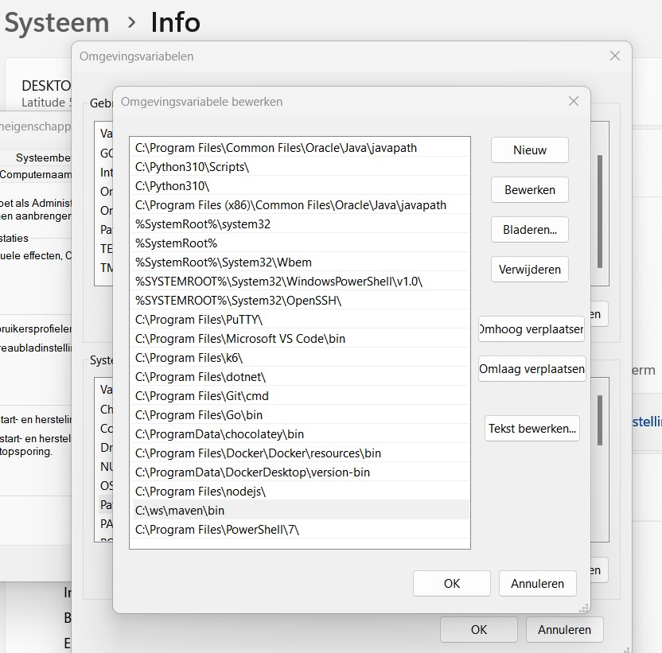
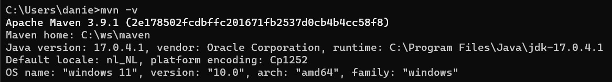

# Voorbereidingen

## ChatGPT account

Maak een account aan op [ChatGPT](https://chat.openai.com/)

## Java 17 installeren

- Installatie-instructies Java 17 voor [Windows](https://java.tutorials24x7.com/blog/how-to-install-java-17-on-windows)
  of [MacOs](https://www.codejava.net/java-se/install-oracle-jdk-17-on-macos). Controleer in de instructies welk versie
  geschikt is voor jouw OS.

- [Java download link](https://www.oracle.com/java/technologies/javase/jdk17-archive-downloads.html)

## Maven 3.9.1 installeren

- Als je Maven nog niet hebt geinstalleerd
  download [Maven](https://dlcdn.apache.org/maven/maven-3/3.9.1/binaries/apache-maven-3.9.1-bin.zip)
    - Unzip het bestand en plaats het op een plek naar keuze:
        - Voorbeeld Windows: "C:\ws\maven"
        - Voorbeeld Mac: ""

    - Voeg de Maven bin folder toe aan je path variablen.
        - Voorbeeld Windows: 
        - Voorbeeld Mac:

Controleer of Maven goed geinstalleerd is door de command prompt te openen en typ "mvn -v"


Reboot je laptop zodat je zeker weet dat maven goed is geïnstalleerd. Als je dit niet doet kan het zijn dat maven niet
herkent, wordt.

Weet je niet hoe je Maven installeert volg dan de stappen in de link
voor [Windows](https://phoenixnap.com/kb/install-maven-windows)
en [MacOs](https://www.digitalocean.com/community/tutorials/install-maven-mac-os)

# Intellij

##  Project aanmaken in Intellij
- Geef je project een naam en kies voor de optie Maven bij Build system
  

## Plugins in Intellij installeren

- Gherkin
- Cucumber for java

Komen de plugins niet terug in de zoekresultaten, Controleer dan ook het tabje met de al geïnstalleerde plugins.


## Resources folder toevoegen
Volg de onderstaande stappen om de resource folder toe te voegen aan het project onder de test folder zodat uiteindelijk dit het eindresultaat is ``` src/test/resources ```


# Visual Studio Code

## Installeer extensions voor Visual Studio Code
Klik op de extension knop van Visual Studio Code. Zoek vervolgens op `Extension Pack for Java` en installeer deze. 
Zoek ook op `Cucumber (Gherkin) Full Support` en installeer deze ook.

## Project aanmaken in Visual Studio Code
Druk op `ctrl` + `shift` + `p` of `cmd` + `shift` + `p` in VS Code.
Type daar: `Java: Create Java Project`.
Selecteer vervolgens `Maven` en bij de archtype zoek naar `io.cucumber`, waarschijnlijk moet je eerst nog op More... klikken. Selecteer de meest recente versie.
Geef een group Id en artifact Id in, vervolgens kan je de locatie selecteren waar je het project op wilt slaan.

## Dependency toevoegen in pom.xml

Tip: Wanneer je over het panel hovert verschijnt er een kopieerknop.

```xml
    <dependencies>
        <dependency>
            <groupId>io.cucumber</groupId>
            <artifactId>cucumber-java</artifactId>
            <version>7.11.1</version>
            <scope>test</scope>
        </dependency>
    </dependencies>
```


## Resources folder toevoegen
Volg de onderstaande stappen om de resource folder toe te voegen aan het project onder de test folder zodat uiteindelijk dit het eindresultaat is ``` src/test/resources ```


