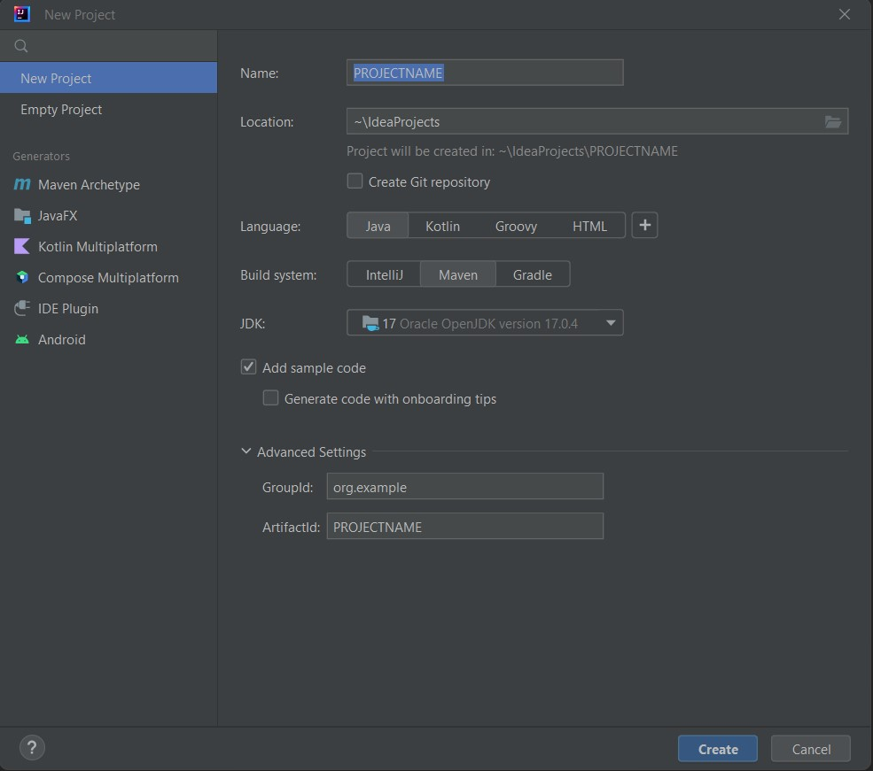
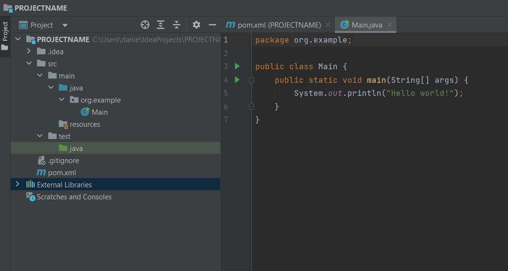
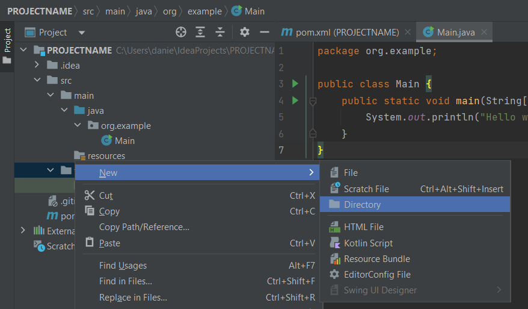
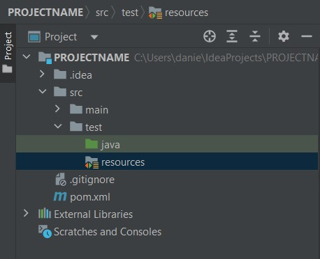
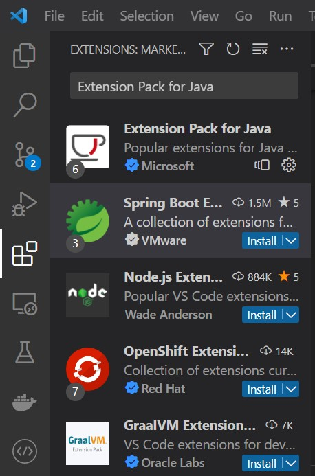
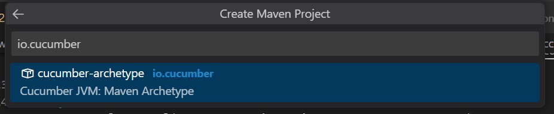

# Voorbereidingen

## ChatGPT account
Maak een account aan op [ChatGPT](https://chat.openai.com/)

## IDE
Zorg dat je een ontwikkelomgeving (IDE) geïnstalleerd hebt. Voor Java adviseren wij 
- [IntelliJ](https://www.jetbrains.com/idea/) - wil je dit installeren?
- [Visual Studio Code](https://code.visualstudio.com/Download) - wil je dit installeren? 

## Java 17 installeren
Volg de installatie-instructies Java 17 voor [Windows](https://java.tutorials24x7.com/blog/how-to-install-java-17-on-windows) of [macOS](https://www.codejava.net/java-se/install-oracle-jdk-17-on-macos). Controleer in de instructies welk versie geschikt is voor jouw OS. De Java-ontwikkelomgeving (JDK) is te vinden [op deze pagina](https://www.oracle.com/java/technologies/javase/jdk17-archive-downloads.html).

##  Maven 3.9.1 installeren
- Als je Maven nog niet hebt geïnstalleerd download [Maven](https://dlcdn.apache.org/maven/maven-3/3.9.1/binaries/apache-maven-3.9.1-bin.zip)

- Volg vervolgens de installatiestappen via de link voor [Windows](https://phoenixnap.com/kb/install-maven-windows) of [macOS](https://www.digitalocean.com/community/tutorials/install-maven-mac-os)

Mocht Maven nog toch niet herkend worden door je laptop? Reboot je laptop en controleer hierna of Maven goed is geïnstalleerd.

# IntelliJ

##  Project aanmaken in IntelliJ
- Geef je project een naam en kies voor de optie Maven bij Build system


##  Plugins in IntelliJ installeren
Je hebt plug-ins nodig in IntelliJ zodat hij BDD-scenarios herkent.

Ga naar file → settings → plugins. Zoek en installeer onderstaande plug-ins.
- Gherkin
- Cucumber for Java

Komen de plug-ins niet terug in de zoekresultaten? Controleer dan ook het tabje rechtsboven in het venster met de al geïnstalleerde plug-ins.

## Resources folder toevoegen
Volg de onderstaande stappen om de resource folder toe te voegen aan het project onder de test folder zodat uiteindelijk dit het eindresultaat is ``` src/test/resources ```








##  Dependency toevoegen in pom.xml
Tip: Wanneer je over het onderstaande panel hovert verschijnt er een kopieer knop.
```xml
    <dependencies>
        <dependency>
            <groupId>io.cucumber</groupId>
            <artifactId>cucumber-java</artifactId>
            <version>7.11.1</version>
            <scope>test</scope>
        </dependency>
    </dependencies>
```

# Visual Studio Code

## Installeer extensions voor Visual Studio Code
Klik op de extension knop van Visual Studio Code. Zoek vervolgens op 
- `Extension Pack for Java` en installeer deze. 
- `Cucumber (Gherkin) Full Support` en installeer deze ook.



## Project aanmaken in Visual Studio Code
- Druk op `ctrl` + `shift` + `p` of `cmd` + `shift` + `p` in VS Code.
- Type daar: `Java: Create Java Project`.
- Selecteer vervolgens `Maven` 
- Zoek bij de archtype naar `io.cucumber`, waarschijnlijk moet je eerst nog op More... klikken.
- Selecteer de meest recente versie.
- Geef een group Id en artifact Id in, vervolgens kan je de locatie selecteren waar je het project op wilt slaan.



