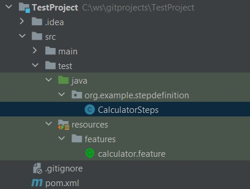
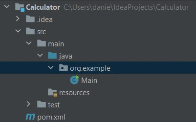

# Opdracht 1: Rekenmachine

Je zit op je opdracht in een nieuw project. Voor dit project moet een rekenmachine worden gebouwd. Dit moet je doen door
gebruik te maken van Behaviour-driven development BDD. Vanuit de business heb je de volgende vier requirements gekregen:

### Requirements:

- **Optellen:** de rekenmachine moet een methode bieden om twee of meer getallen bij elkaar op te tellen, met
  ondersteuning voor decimalen en negatieve waarden.

- **Aftrekken:** de rekenmachine moet een methode bevatten om het ene getal van het andere af te trekken, inclusief
  decimalen en negatieve waarden.

- **Vermenigvuldiging:** de rekenmachine moet een methode bieden om twee of meer getallen met elkaar te
  vermenigvuldigen, waarbij decimalen en negatieve waarden worden ondersteund.

- **Delen:** de rekenmachine moet een methode bevatten om het ene getal door het andere te delen, met ondersteuning voor
  decimalen en het omgaan met deling door nul-fouten.

> **IMPORTANT NOTE:** Voordat we gaan beginnen, straks gaan we gebruiken maken van ChatGPT, controleer zelf het
> antwoordt dat wordt teruggegeven door ChatGPT! De gegeneerde code is namelijk niet altijd 100% correct, maar geeft je
> een zetje in de goede richting. Dit zorgt voor een kritische blik op dat wat je laat genereren.

## 1.1 Cucumber Feature file maken.

Een feature file beschrijft een scenario in begrijpelijke mensentaal. In die feature file wordt het gewenste gedrag
beschreven welke stappen er genomen dienen te worden om tot een bepaald resultaat te komen.

Een voorbeeld van een feature file ziet er uit als volgt:

```yml
Scenario: Scenarionaam
  Given I have one pizza
  And Cut the pizza in 8 slices
  When I eat 2 slices
  Then The result is 6 slices left
```

- **Opdracht:** Genereer een Cucumber feature file met de gegeven requirements in ChatGPT.

- **Opdracht:** Maak een nieuwe folder in je project aan genaamd: "features". Deze folder moet onder de resources folder
  komen zoals in de voorbereidingen is gedaan.

Als de feature file is gegenereerd, kan je de gegenereerde code kopiëren. Plak de code in een bestand in de features
folder zoals hieronder weergegeven. Maak dit bestand eerst aan.

```yml
- src
  - test
  - java
  - resources
  - features
  - calculator.feature
```

## 1.2 Maak een step file aan

Een step file is een bestand dat de implementatie van de stappen beschrijft die in een scenario zijn gedefinieerd.

De step file koppelt de stappen uit de Gherkin scenario's aan de daadwerkelijke Java klasse voor de calculator in dit
geval. De step file kan gezien worden als de koppeling tussen De uiteindelijke implementatie en de feature file met
Gherkin.

Een step file in Java wordt geschreven als een Java-klasse met behulp van Cucumber's Java API. Deze klasse bevat
methoden die zijn geannoteerd door specifieke Cucumber-annotaties, zoals @Given, @When, @Then, @And en @But.

- **Opdracht:** Maak een bestand aan in de map zoals hieronder in de afbeelding weergegeven. Geef dit bestand de
  naam: `CalculatorSteps.java`.



Aangezien ChatGPT gesprekscontext begrijpt, is het niet nodig om context mee te geven aan de vraag of ChatGPT de step
file wilt genereren. De eerder gegeneerde Gherkin code wordt automatisch gebruikt om het vervolg te maken.

> **Hint:** Vraag aan ChatGPT of deze de step file wilt genereren in java.

## 1.3 Calculator applicatie

Tot slot, om de cucumber testen te laten slagen is de java code nodig voor de calculator zelf. Dit kan je doen op
dezelfde manier als bij opdracht 1.1 & 1.2.

Maak eerst een nieuw Java-bestand aan in je project voor de Calculator-klasse. Plaats het
onder `src/main/java/com/example` met de bestandsnaam `Calculator.java`.



- **Opdracht:** Plak de gegeneerde code door ChatGPT in het `Calculator.java` bestand.

## 1.4 run test

Om te kijken of de testen nu slagen kan je de Cucumber test file uitvoeren door rechtermuisknop te drukken op
de `calculator.feature` en op `run feature: calculator` te drukken.

Als alles in een keer goed gaat, heb je nu geen faalden testen. Echter bestaat er een mogelijkheid dat er toch iets fout
gaat.
Als dit fout gaat kan je proberen om de foutmelding in ChatGPT te geven samen met de methode waar het fout gaat. Dan kan
ChatGPT dit in sommige gevallen oplossen.

Zo niet? Probeer er achter te komen wat er mis gaat en het zelf op te lossen. Kom je er echt niet uit vraag iemand met
een the/experts. shirt om wat hulp.

## 1.5 Uitbreiden

Herhaal boven staande stappen en voeg extra functionaliteit toe aan de calculator voor de volgende 6 requirements.

- **Machtsverheffing:** De rekenmachine moet een methode bieden om een getal tot een gegeven macht te verheffen,
  inclusief fractionele en negatieve exponenten.

- **Vierkantswortel:** De rekenmachine moet een methode hebben om de vierkantswortel van een gegeven getal te berekenen,
  met de mogelijkheid voor zowel positieve als negatieve invoerwaarden.

- **Functie van een getal:** De rekenmachine moet een methode bieden om de functie van een niet-negatief geheel getal te
  berekenen.

- **Logaritmes:** De rekenmachine moet methoden bevatten om natuurlijke logaritmes (basis e) en gemeenschappelijke
  logaritmes (basis 10) van positieve getallen te berekenen.

- **Trigonometrie:** De rekenmachine moet methoden bieden om de sinus, cosinus en tangens van hoeken te berekenen, met
  ondersteuning voor zowel radialen als graden.

- **Geheugenfuncties:** De rekenmachine moet methoden hebben om een waarde in het geheugen op te slaan, op te roepen en
  te wissen, zodat gebruikers gemakkelijker complexe berekeningen kunnen uitvoeren.
