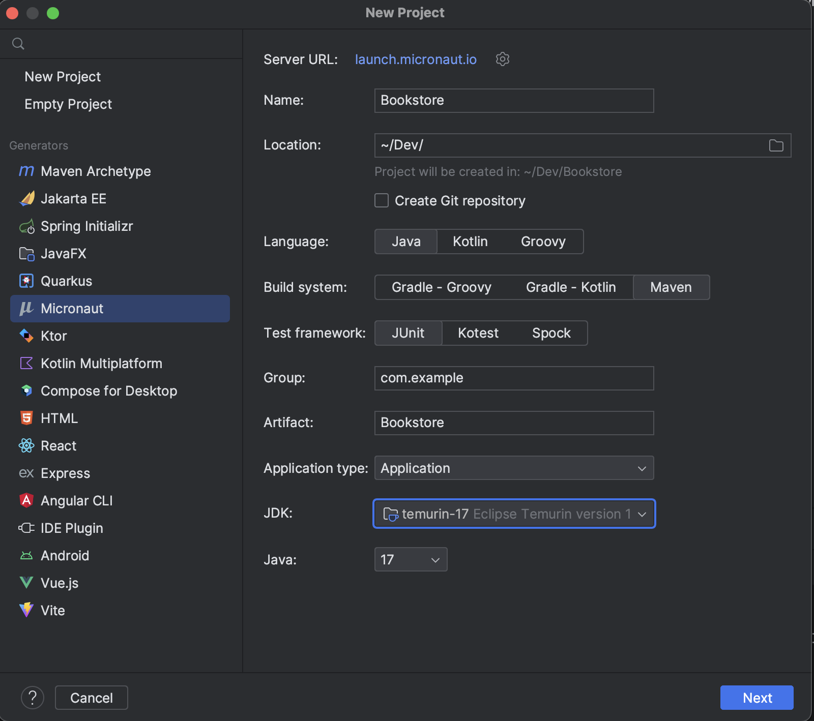

# Opdracht 3: Micronaut Application
In deze opdracht gaan we aan de hand van Micronaut de Bookstore API opzetten. Micronaut is een lichtgewicht, modulair webapplicatie framework dat is ontworpen om high-performance, schaalbare en cloud-native microservices te bouwen.
Micronaut biedt een breed scala aan functies en mogelijkheden voor het bouwen van microservices, waaronder ondersteuning voor HTTP/2, reactive programming, distributed tracing, service discovery en cloud-native deployment.
Dit framework is vrij nieuw en daarom is het interesant om een API op te zetten met Micronaut.

## Opdracht 3.1
Maak een derde project aan, selecteer nu Micronaut zoals in de afbeelding hier onder.

 
Voor Visual Studio volg de zelfde stappen als vorige opdrachten maar in plaats van Cucumber archtype, 
zoek naar `io.github.gasches.archetypes`, als het goed is komt dan `micronaut-service` naar boven, selecteer deze.

## Opdracht 3.2
Vraag aan ChatGPT of deze een Micronaut applicatie kan ontwikkelen aan de hand van de feature file die in opdracht 2 is gegenereerd.
Hier in zal je waarschijnlijk een `Book` en een `BookController` klasse krijgen. Plaats deze bestanden in de `src/main/java/com/example/` directory.

Als alles volgens plan verloopt, zou je nu een Micronaut API moeten hebben. Je kan deze draaien door `./mvnw mn:run` uit te voeren in de terminal.

# Opdracht 3.3
Tot slot kan je de test van opdracht 2 proberen uit te voeren door `./mvnw test` uit te voeren in de terminal.

