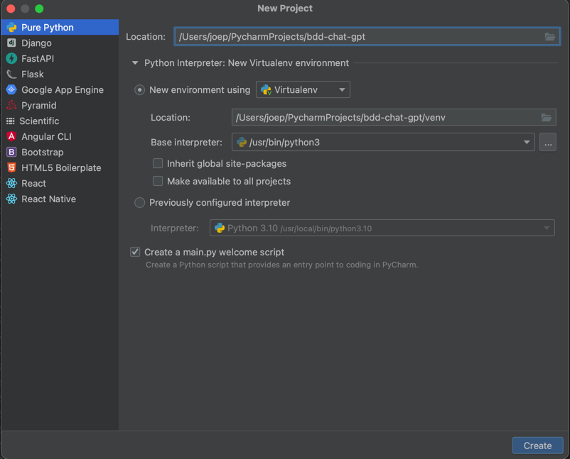
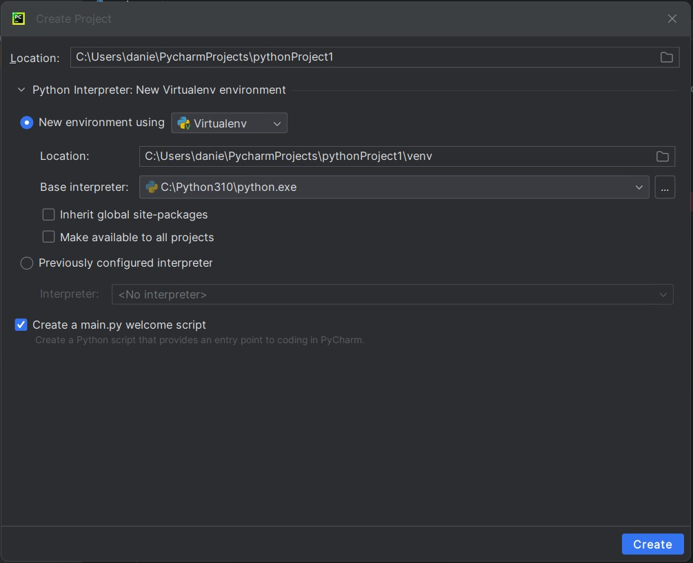

# Voorbereidingen

## ChatGPT account
Maak een account aan op [ChatGPT](https://chat.openai.com/)


## Python installeren
Volg de installatie-instructies voor Python voor [Windows](https://www.digitalocean.com/community/tutorials/install-python-windows-10) of [macOS](https://www.makeuseof.com/how-to-install-python-on-mac/). Controleer in de instructies welk versie geschikt is voor jouw OS.

## IDE
Zorg dat je een ontwikkelomgeving (IDE) geïnstalleerd hebt. Voor Python adviseren wij een van de twee onderstaande tools.
- [PyCharm](https://www.jetbrains.com/pycharm/download) - wil je dit installeren?
- [Visual Studio Code](https://code.visualstudio.com/Download) - wil je dit installeren? 

## Project aanmaken in PyCharm
Open PyCharm en klik op nieuw project. Mocht je PyCharm al hebben geïnstalleerd en je een oudere versie hebt kan het zijn dat je de optie krijg om een framework te kiezen zoals in het plaatje hieronder. Selecteer `Pure Python` en geef je project een naam.




Zie je deze optie niet zoals in de afbeelding hieronder geef dan je project alleen een naam en klik op create


## Project aanmaken in Visual Studio Code
- Maak een projectmap aan op een locatie naar keuze. 

- Open de projectmap in Visual Studio Code via File -> Add Folder to Workspace

## Installeer extensions voor Visual Studio Code
Voor een goede werking van Python in Visual Studio Code is het verstandig om een tweetal extensies te installeren, hierdoor krijg je bijvoorbeeld betere linting, debugging en indentation. 
De volgende extensions moet je hiervoor installeren.
- `Python`
- `Python Extension Pack`


##  Packages installeren 
Als laatste stap gaan we nog een aantal packages installeren via pip. pip is de package installer voor python. 

Open de terminal in PyCharm/Visual Studio Code en installeer de volgende packages aan de hand van deze commands:
```
pip install behave
pip install fastapi
pip install uvicorn
pip install pydantic
pip install requests
```
