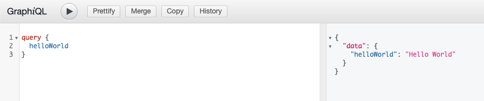

# Create a resolver

In the previous step we already added our GraphQL schema file.
```graphql
type Query {
    helloWorld: String!
}
```
 
It defines that we have a Query, called helloWorld, and it returns a String.
However, if we invoke the Query via our GraphiQL client, we are getting an error.
That error tells us that you should never get null as a result according to 
the graph note the exclamation behind the string.
However, it still is null. Let's create a resolver that resolves that issue.

in your src directory `src/main/java/nl/codecentric/springforgraphql`
create a new package called `helloworld` and, within that package, create a `HelloWorldController.java`


To make the query work we need three things:
1. Annotate the class with a `@Controller` annotation.
2. A method that resembles the same name you have in the schema.graphqls, in our case helloWorld. And return a String
3. Annotate that method as a `@QueryMapping`

Finally, try out your query in the GraphiQL interface



